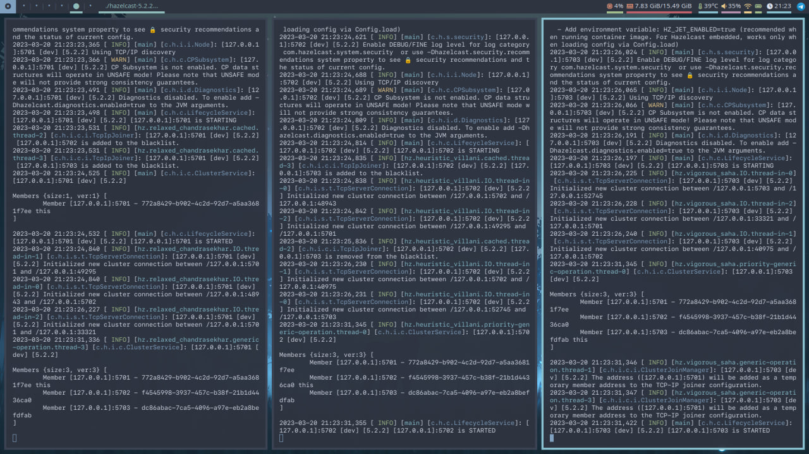
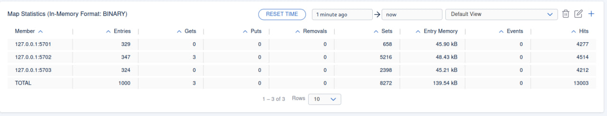

# Homework 2: Hazelcast

> ### 1. Distributed map

Using `map.py` you can create distributed map with `1000` key-value pairs.

To make this work you should first need to download `hazelcast` and using `./hazelcast-5.2.2/bin/hz start -c=cluster-config.yaml ` you can run cluster locally. Start `hazelcast` 3 times to activate all 3 nodes like this:



Only then you can run `map.py` like this:

```bash
python map.py
```
`Output`:
```
Lifecycle event >>> STARTING
Lifecycle event >>> STARTED
Lifecycle event >>> CONNECTED
Connected to cluster
value for 500th key
Map size: 1000
Lifecycle event >>> SHUTTING_DOWN
Lifecycle event >>> DISCONNECTED
Lifecycle event >>> SHUTDOWN
```
To see how values are destributed among nodes you can use `hazelcast management` (needs to be downloaded seperately). Use `./hazelcast-management-center-5.2.1/bin/start.sh` and go to `http://localhost:8080`. There you can find all the information about the cluster.

Regarding the destribution, as you can see bellow data is evenly destributed. Also, killing one of the nodes will just redestribute its data to the other 2 nodes, no data loss.




> ### 2. Distributed map with locks

Using `lock_map.py` you can see how map works with and without locks.

Running `lock_map.py` will run `update_without_lock`, `update_passimistic_lock`, `update_optimistic_lock` in 3 threads each. Each function updates value of the same key by incrementing it.

```bash
python lock_map.py
```
From the output below you can see that updating without locks creates a data race.

Passimistic lock works perfectly (but is very slow obviously).

Optimistic makes it so thread 3 will always have perfect score, but 1 and 2 are still exposed to data race. 

`Output`:
```
Lifecycle event >>> STARTING
Lifecycle event >>> STARTED
Lifecycle event >>> CONNECTED
Connected to cluster
Run without lock:
1232                        # thread 1 output
1233                        # thread 2 output
1235                        # thread 3 output
Run passimistic lock:
2998                        # thread 1 output
2999                        # thread 2 output
3000                        # thread 3 output
Run optimistic lock:
2485                        # thread 1 output
2508                        # thread 2 output
3000                        # thread 3 output
All done
Lifecycle event >>> SHUTTING_DOWN
Lifecycle event >>> DISCONNECTED
Lifecycle event >>> SHUTDOWN
```

> ### 3. Bounded queue

To run bounded queue use:
```bash
chmod -x runner.sh
./ranner.sh
``` 
This script just runs 3 clients, 1 instence of `producer (producer.py)` and 2 instances of `consumers (consumer.py)`.

Producer automatically starts producing data to the queue, and 2 consumers consume it.

If there will be no consumers, queue will be full.

As you can see from the output below, having 2 consumers they take data faster the produser can produce it, but logs show that that they actually consume data in order, but it is actually is not the case, the order is random.

If you want to rerun experiment, make sure to run the command below, because there will be a few disparented processes runnig on the background, you will need to kill them.
```bash
killall python
```

`Output`:
```
Lifecycle event >>> STARTING
Lifecycle event >>> STARTING
Lifecycle event >>> STARTED
Lifecycle event >>> STARTED
Lifecycle event >>> STARTING
Lifecycle event >>> STARTED
Lifecycle event >>> CONNECTED
Lifecycle event >>> CONNECTED
Lifecycle event >>> CONNECTED
Connected to cluster
Connected to cluster
Connected to cluster
Produce 0
Consumer 2 consumes 0
Consumer 1 consumes 1
Produce 1
Produce 2
Consumer 2 consumes 2
Produce 3
Consumer 1 consumes 3
Produce 4
Consumer 2 consumes 4
Produce 5
Consumer 1 consumes 5
Produce 6
Consumer 2 consumes 6
Produce 7
Consumer 1 consumes 7
Produce 8
Consumer 2 consumes 8
Produce 9
Consumer 1 consumes 9
Produce 10
Consumer 2 consumes 10
Produce 11
Consumer 1 consumes 11
Consumer 2 consumes 12
Produce 12
Produce 13
Consumer 1 consumes 13
Produce 14
Consumer 2 consumes 14
Produce 15
Consumer 1 consumes 15
Produce 16
Consumer 2 consumes 16
Produce 17
Consumer 1 consumes 17
Produce 18
Consumer 2 consumes 18
Produce 19
Consumer 1 consumes 19
Produce 20
Consumer 2 consumes 20
Produce 21
Consumer 1 consumes 21
Produce 22
Consumer 2 consumes 22
Produce 23
Consumer 1 consumes 23
Consumer 2 consumes 24
Produce 24
Produce 25
Consumer 1 consumes 25
Produce 26
Consumer 2 consumes 26
Produce 27
Consumer 1 consumes 27
Produce 28
Consumer 2 consumes 28
Produce 29
Consumer 1 consumes 29
Produce 30
Consumer 2 consumes 30
Produce 31
Consumer 1 consumes 31
Produce 32
Consumer 2 consumes 32
Produce 33
Consumer 1 consumes 33
Produce 34
Consumer 2 consumes 34
Produce 35
Consumer 1 consumes 35
Produce 36
Consumer 2 consumes 36
Produce 37
Consumer 1 consumes 37
Produce 38
Consumer 2 consumes 38
Produce 39
Consumer 1 consumes 39
Produce 40
Consumer 2 consumes 40
Produce 41
Consumer 1 consumes 41
Produce 42
Consumer 2 consumes 42
Produce 43
Consumer 1 consumes 43
Produce 44
Consumer 2 consumes 44
Produce 45
Consumer 1 consumes 45
Produce 46
Consumer 2 consumes 46
Produce 47
Consumer 1 consumes 47
Consumer 2 consumes 48
Produce 48
Produce 49
Consumer 1 consumes 49
Produce 50
Consumer 2 consumes 50
Produce 51
Consumer 1 consumes 51
Produce 52
Consumer 2 consumes 52
Produce 53
Consumer 1 consumes 53
Produce 54
Consumer 2 consumes 54
Produce 55
Consumer 1 consumes 55
Produce 56
Consumer 2 consumes 56
Consumer 1 consumes 57
Produce 57
Produce 58
Consumer 2 consumes 58
Produce 59
Consumer 1 consumes 59
Produce 60
Consumer 2 consumes 60
Produce 61
Consumer 1 consumes 61
Produce 62
Consumer 2 consumes 62
Produce 63
Consumer 1 consumes 63
Produce 64
Consumer 2 consumes 64
Produce 65
Consumer 1 consumes 65
Produce 66
Consumer 2 consumes 66
Produce 67
Consumer 1 consumes 67
Produce 68
Consumer 2 consumes 68
Produce 69
Consumer 1 consumes 69
Produce 70
Consumer 2 consumes 70
Produce 71
Consumer 1 consumes 71
Produce 72
Consumer 2 consumes 72
Produce 73
Consumer 1 consumes 73
Produce 74
Consumer 2 consumes 74
Produce 75
Consumer 1 consumes 75
Produce 76
Consumer 2 consumes 76
Produce 77
Consumer 1 consumes 77
Produce 78
Consumer 2 consumes 78
Produce 79
Consumer 1 consumes 79
Produce 80
Consumer 2 consumes 80
Produce 81
Consumer 1 consumes 81
Produce 82
Consumer 2 consumes 82
Produce 83
Consumer 1 consumes 83
Produce 84
Consumer 2 consumes 84
Produce 85
Consumer 1 consumes 85
Produce 86
Consumer 2 consumes 86
Produce 87
Consumer 1 consumes 87
Produce 88
Consumer 2 consumes 88
Produce 89
Consumer 1 consumes 89
Produce 90
Consumer 2 consumes 90
Produce 91
Consumer 1 consumes 91
Produce 92
Consumer 2 consumes 92
Produce 93
Consumer 1 consumes 93
Produce 94
Consumer 2 consumes 94
Produce 95
Consumer 1 consumes 95
Produce 96
Consumer 2 consumes 96
Produce 97
Consumer 1 consumes 97
Produce 98
Consumer 2 consumes 98
Produce 99
Consumer 1 consumes 99
```