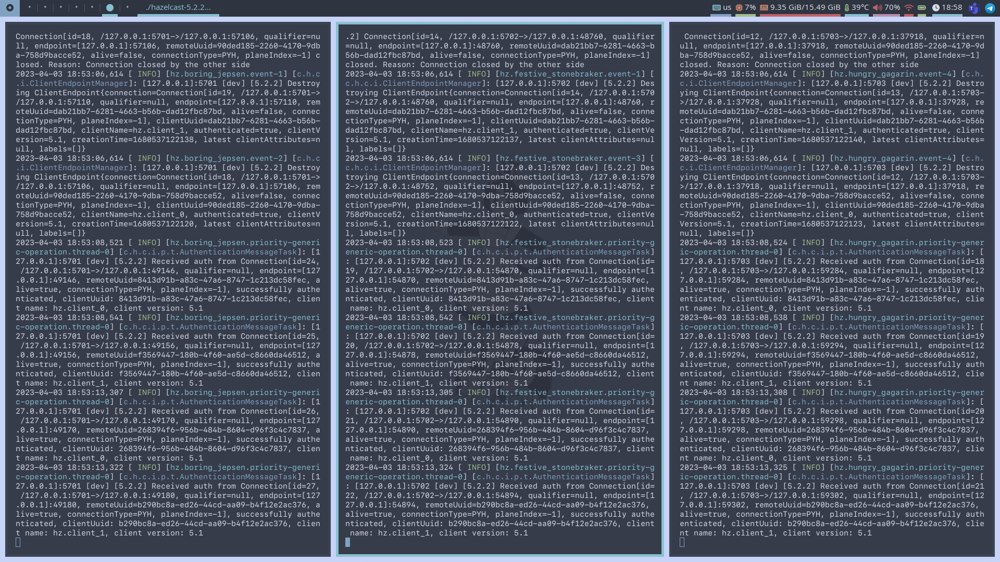
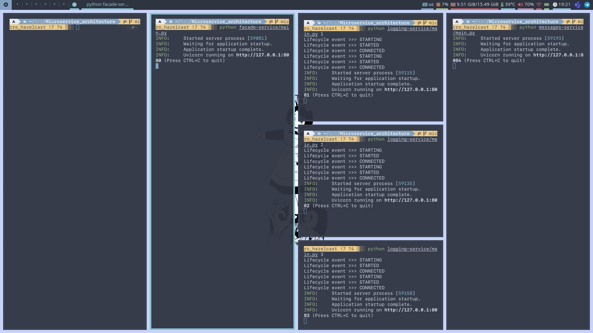
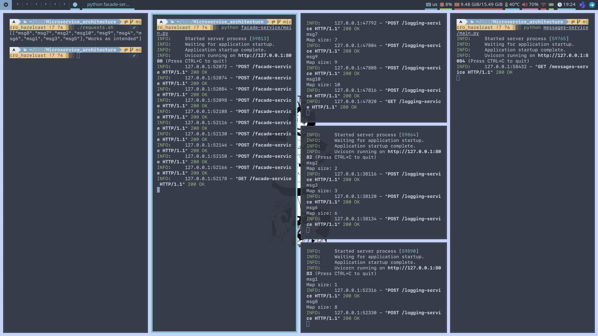
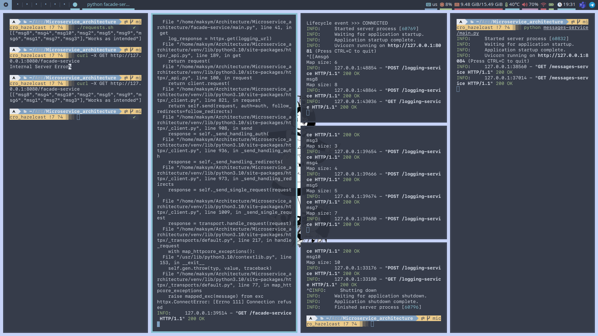

## Basic Mircoservices

### Prerequirements
    python 3.6 or higher

> ### Create venv and install requirements.txt
>```bash
>$ python -m venv venv
>
>$ . venv/bin/activate
>
>$ pip install -r requirements.txt 
>
>```
> </>

### Usage
> First

To make this work you should first need to download `hazelcast` and using 

    ./hazelcast-5.2.2/bin/hz start -c=cluster-config.yaml

 you can run cluster locally. Start `hazelcast` 3 times to activate all 3 nodes like this:



> Then run all 5 microservices:

You can do this either using `run_services.sh` or using 5 separate terminals 

```
 $ chmod -x ./run_services.sh

 $ ./run_services.sh

    # OR

 $ python facade-service/main.py 
 $ python logging-service/main.py 1 
 $ python logging-service/main.py 2 
 $ python logging-service/main.py 3 
 $ python messages-service/main.py
```

You might also want to use something like

    $ killall python

if you are using `run_services.sh` if you want to stop services.

> Now you can make POST/GET requests using `curl` for example:

You can use `requests.sh` to make 10 `POST` and 1 `GET` request.
```
 $ chmod -x ./requests.sh

 $ ./requests.sh

    # OR
 
 $ curl -X POST http://127.0.0.1:8080/facade-service -H "Content-Type: text/html" -d 'msg1'
 
 # ---|| --- ...
 
 $ curl -X GET http://127.0.0.1:8080/facade-service

```

### Output

On the 2 pictures below you can see before and after the use of `requests.sh`.  





As you can see `logging-service 2` recieved the `msg2`, `msg3` and `msg6`;
`logging-service 3` recieved the `msg1` and `msg8`, others went to the `logging-service 1`.

Output:
```
[["msg8","msg4","msg10","msg2","msg5","msg9","msg6","msg1","msg7","msg3"],"Works as intended"]
``` 

(static message from `message-service` (`"Works as intended"`))

> As you can see from the picture below, if we were to turn off one of the `logging-services` (here `logging-service 3` is off) the problem would be if we randomly choose to make a request to the service that is off, we will recieve an exception, but if you make a request to the active service, no problem will occur, no data loss either.  

> Both cases on the screenshot (first `GET` request failed, second returned all the data)



