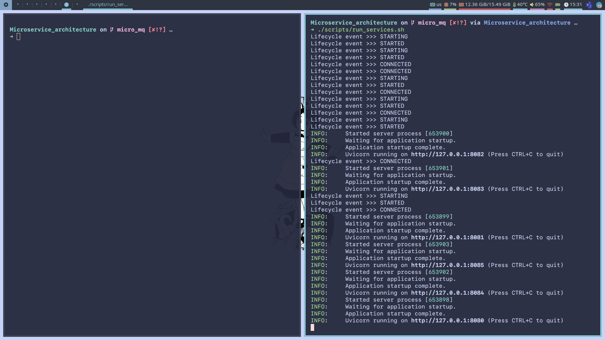
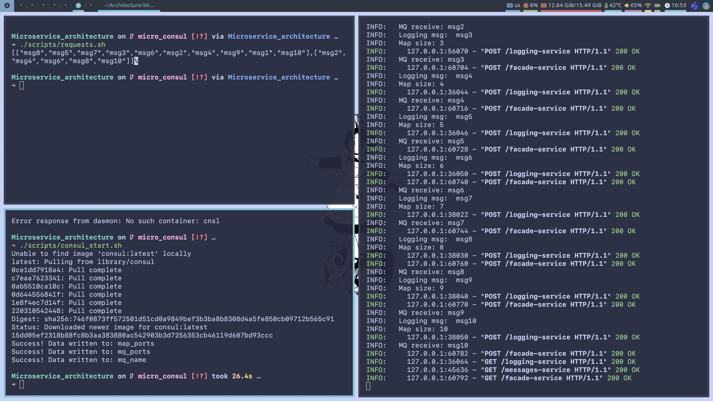

## Basic Mircoservices

### Prerequirements
    python 3.6 or higher

> ### Create venv and install requirements.txt
>```bash
>$ python -m venv venv
>
>$ . venv/bin/activate
>
>$ pip install -r requirements.txt 
>
>```
> </>

### Usage
> First

To make this work you should first need to download `hazelcast` and using 

    ./hazelcast-5.2.2/bin/hz start -c=hazelcast-config.yaml

 you can run cluster locally. Start `hazelcast` 3 times to activate all 3 nodes like this:


> Then you have to start the `consul`:

```
 $ chmod -x ./scripts/start_consul.sh

 $ ./scripts/start_consul.sh

```

> Then run all 6 microservices:

You can do this either using `run_services.sh` or using 6 separate terminals to see the output of each individual service

```
 $ chmod -x ./scripts/run_services.sh

 $ ./scripts/run_services.sh

    # OR
 
 $ python facade-service/service.py --port 8080 
 $ python logging-service/service.py --port 8081 
 $ python logging-service/service.py --port 8082 
 $ python logging-service/service.py --port 8083 
 $ python messages-service/service.py --port 8084
 $ python messages-service/service.py --port 8085
```

You might also want to use something like

    $ killall python

if you are using `run_services.sh` and you want to stop services.

> Now you can make POST/GET requests using `curl` for example:

You can use `requests.sh` to make 10 `POST` and 1 `GET` request.
```
 $ chmod -x ./scripts/requests.sh

 $ ./scripts/requests.sh

    # OR
 
 $ curl -X POST http://127.0.0.1:8080/facade-service -H "Content-Type: text/html" -d 'msg1'
 
 # ---|| --- ...
 
 $ curl -X GET http://127.0.0.1:8080/facade-service

```

### Output

On the 2 pictures below you can see before and after the use of `requests.sh`.  





From the logs you can see how messsages are going to the message queue and to the logging service.

```
.....
INFO:	MQ receive: msg4
INFO:	Logging msg:  msg5
INFO:	Map size: 5
.....
```

Output:
```
[["msg8","msg5","msg7","msg2","msg10","msg9","msg1","msg4","msg6","msg3"],["msg2","msg4","msg6","msg8","msg10"]]
``` 
Firts 10 messages are messages from `logging-service`, other 5 are from one of the node of `messages-service` (random node).
Also, both nodes of `messages-service` save the messages they recieve to the file in direcory `data` with timestamps as the name of the files.

